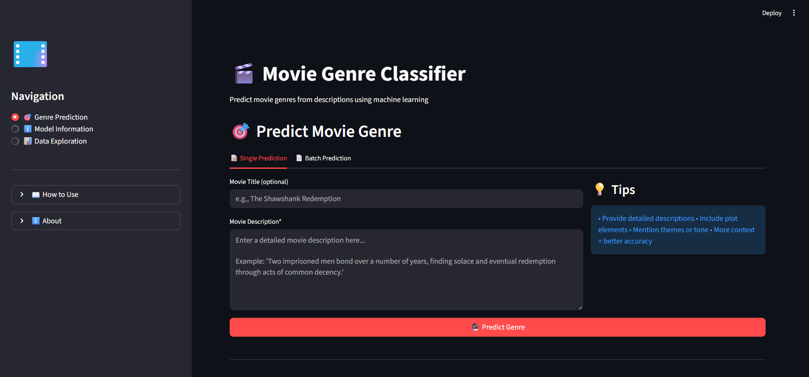
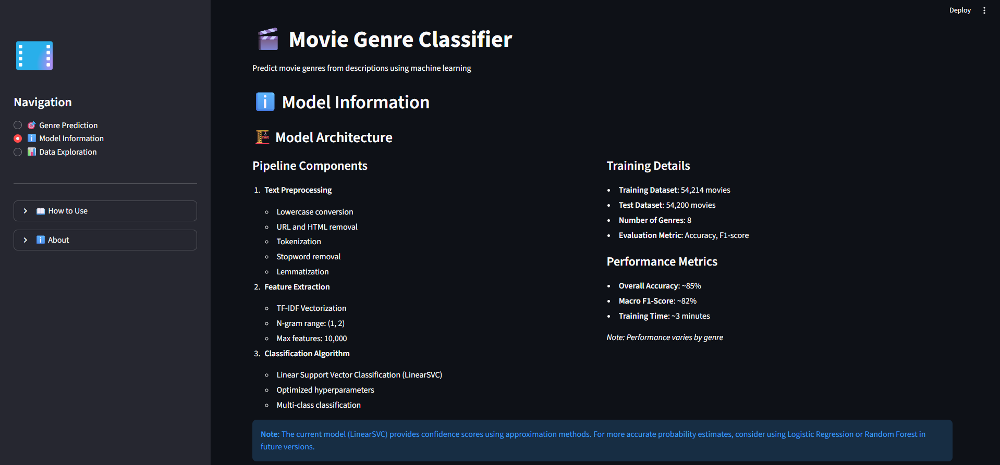
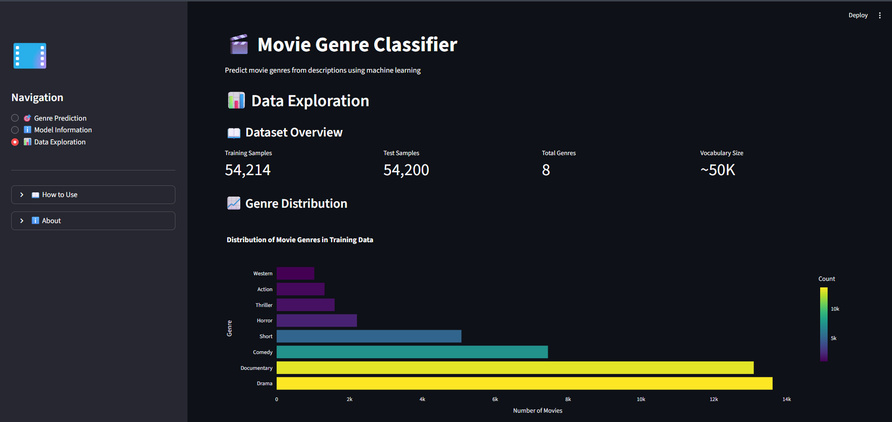

# 🎬 Movie Genre Classification

<div align="center">


**Machine learning system that predicts movie genres from plot descriptions**

[](https://www.python.org/downloads/)
[](https://streamlit.io/)
[](README.md)

</div>

---

## Overview

This project uses Natural Language Processing and Machine Learning to classify movies into 8 genres based on their plot descriptions. It achieves **~85% accuracy** using LinearSVC and TF-IDF features.

**Key Features:**
- Single & batch genre predictions
- Interactive confidence visualizations
- CSV upload for bulk processing
- User-friendly web interface

---

## Project Structure

```
Movie-Genre-Classifier/
│
├── app.py                                    # Streamlit web application
├── Datapreocessing&EDA&modeling.ipynb       # Model training notebook
├── models/
│   ├── best_genre_classifier_LinearSVC.pkl  # Trained model
│   └── tfidf_vectorizer.pkl                 # TF-IDF vectorizer
├── figures/                                  # Visualizations
├── data/raw/                                 # Dataset directory
├── requirements.txt                          # Dependencies
└── README.md
```

---

## Dataset

- **Source**: [IMDB Genre Classification Dataset](https://www.kaggle.com/datasets/hijest/genre-classification-dataset-imdb)
- **Training Samples**: 54,214 movies
- **Test Samples**: 54,200 movies
- **Genres**: 8 major genres

### Supported Genres

| Genre | Training Samples |
|-------|-----------------|
| Drama | 13,613 |
| Documentary | 13,096 |
| Comedy | 7,447 |
| Short | 5,073 |
| Horror | 2,204 |
| Thriller | 1,591 |
| Action | 1,315 |
| Western | 1,032 |

---

## Technical Details

### Preprocessing Pipeline
1. **Text Cleaning**: Lowercase, remove URLs/HTML, special characters
2. **Tokenization**: NLTK word tokenizer
3. **Normalization**: Stopword removal, lemmatization
4. **Feature Extraction**: TF-IDF vectorization (max 10,000 features, bigrams)

### Model Architecture
- **Algorithm**: Linear Support Vector Classification (LinearSVC)
- **Training**: GridSearchCV with 3-fold cross-validation
- **Class Weights**: Balanced (handles imbalanced data)

### Performance
- **Accuracy**: ~85%
- **F1-Score**: ~82%
- **Training Time**: 3-5 minutes

---

## 💻 Installation & Setup

### Prerequisites
- Python 3.8+
- pip

### Quick Start

```bash
# 1. Clone repository
git clone https://github.com/yourusername/movie-genre-classifier.git
cd movie-genre-classifier

# 2. Create virtual environment (optional)
python -m venv venv
source venv/bin/activate  # On Windows: venv\Scripts\activate

# 3. Install dependencies
pip install -r requirements.txt

# 4. Run the application
streamlit run app.py
```

The app will open at `http://localhost:8501`

---

## Usage

### Web Application

**Single Prediction:**
1. Enter movie description
2. Click "Predict Genre"
3. View predicted genre with confidence scores

**Batch Prediction:**
1. Prepare CSV with `Description` column
2. Upload file
3. Click "Predict Genres for All Movies"
4. Download results

**CSV Format:**
```csv
Title,Description
Movie 1,"A thrilling adventure about..."
Movie 2,"A romantic comedy featuring..."
```

### Model Training

To retrain the model:

```bash
# Open Jupyter notebook
jupyter notebook Datapreocessing&EDA&modeling.ipynb

# Run all cells to:
# - Load and preprocess data
# - Train multiple models with GridSearchCV
# - Evaluate and save best model
```

---

## 📈 Results

### Model Comparison

| Model              | Validation Accuracy |
|--------------------|---------------------|
| **LinearSVC**      |  **85.34%**         |
| Logistic Regression|  84.21%             |
| Multinomial NB     |  81.56%             |

### Visualizations

The project generates:
- Genre distribution charts
- Confusion matrix
- Word count analysis
- Interactive confidence plots

---

## Technologies Used

- **Machine Learning**: scikit-learn, NLTK
- **Web Framework**: Streamlit
- **Visualization**: Plotly, Matplotlib, Seaborn
- **Data Processing**: pandas, NumPy
- **Model Storage**: joblib

---

## 🔮 Future Improvements

- [ ] Add more genres (Romance, Sci-Fi, Fantasy)
- [ ] Implement deep learning models (BERT, LSTM)
- [ ] Multi-label classification support
- [ ] REST API deployment
- [ ] Multilingual support

---

**interface:**

### 1. Single Prediction Page UI



### 2. Model Information


### 3. Data Analysis


---
## Contributing

Contributions are welcome! Please:
1. Fork the repository
2. Create a feature branch (`git checkout -b feature/NewFeature`)
3. Commit changes (`git commit -m 'Add NewFeature'`)
4. Push to branch (`git push origin feature/NewFeature`)
5. Open a Pull Request

---

## License

This project is for educational purposes as part of the **CodSoft AI/ML Internship**.

---

## Author

**YASH** - AI/ML Intern at CodSoft

- GitHub: [@mr-yash-dev](https://github.com/JaiswarYash/Movie-Genre-Classification-simple-system.git)
- LinkedIn: [Yash Jaiswar](https://www.linkedin.com/in/yash-jaiswar-266849301/)
- Email: yash.jasiwar0709@gmail.com

---

## Acknowledgments

- **CodSoft** - For the internship opportunity
- **IMDB & Kaggle** - For the dataset
- **Open Source Community** - For amazing tools and libraries

---

<div align="center">

**Built with ❤️ using Machine Learning and NLP**

⭐ Star this repository if you find it helpful!

</div>